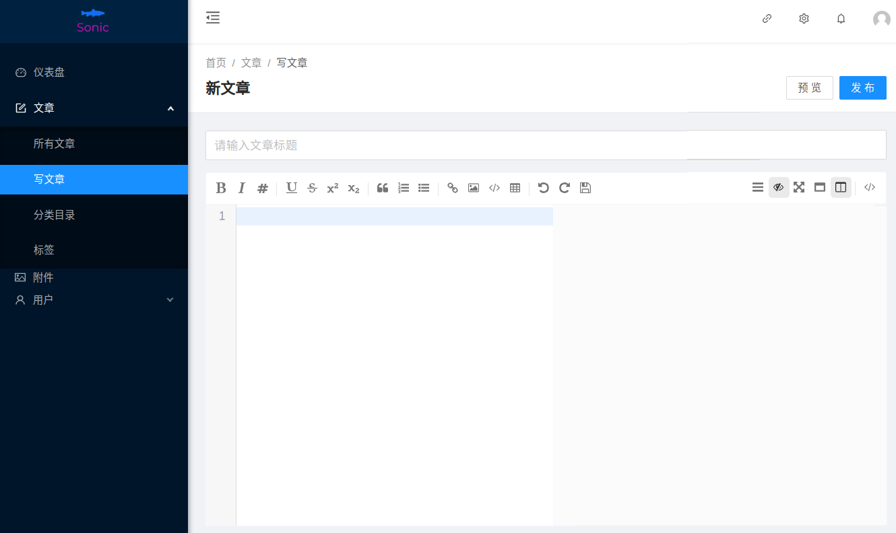

# 个人博客案例设计

## 一. 引言

### 1. 项目背景

个人博客系统主要用于发表个人博客，记录个人生活日常、学习心得以及技术分享等，供他人浏览、查阅、评论等。个人博客往往作为技术人员的个人知识发布管理平台，以便于记录某项技术使用教程，也有利于与同行业的从业人员进行交流。

本项目致力于构建一个个人博客平台, 每个注册用户都可以发布,管理自己的博客, 也可以浏览,评论他人的博客. 系统还包含了搜索功能和关注功能, 用户可以方便地寻找到自己需要的功能, 并及时得到来自关注博主的消息. 此外, 由于博文采用富文本形式展现, 平台还包含了文件存储的功能, 用户可以将上传的图片嵌入到自己的博客中, 或上传资源分享给别人. 

### 2. 用户特征和水平

本软件主要面向计算机技术人员, 计算机专业的学生,从业者,爱好者. 编写博客的人应该有基础的markdown标记语言的使用技能, 愿意分享技术.

## 二. 需求描述

### 1. 功能描述 (概要)

个人博客涉及到的角色不多. 这里按照博主和浏览者两个角色列出功能. 

1. 博主功能

| 功能         | 描述                                                                                                               |
|--------------|--------------------------------------------------------------------------------------------------------------------|
| 登录注册     | 非注册用户只可以浏览和搜索                                                                                         |
| 博客编写发布 | 这主要是前端的功能, 要提供一个markdown编辑器, 以及发布的选项(是否允许评论等). 参见本节末示例开源项目*Sonic*.       |
| 博客管理     | 列出当前用户的所有博文, 点击进入博文详情页后可以编辑管理博文的权限, 如设置是否允许评论,审核评论,设置公开/私有等等. |
| 标签系统     | 用户可以自己添加标签. 系统会定时招安定义次数多的标签                                                               |
| 附件管理     | 上传,删除附件/图片/其他多媒体, 可以复制链接以便在富文本编辑器中使用.                                               |

> 上述大部分功能来源于项目*Sonic*. 请在本节末的示例开源项目中查询.

2. 浏览者功能

| 功能         | 描述                                                                                |
|--------------|-------------------------------------------------------------------------------------|
| 主页         | 主页会按照时间/热度顺序列出所有的博文, 以及点赞数量等信息; 提供个人中心和搜索的入口 |
| 搜索         | 提供基于标签搜索和基于文本搜索的功能.                                               |
| 评论回复     | 浏览者可以评论帖子, 或回复他人的评论. 这些操作将通知被评论/回复者.                  |
| 点赞收藏关注 | 可以点赞帖子或评论. 也可以收藏他人帖子或关注博主. 这些操作都会有相应的通知          |
| 个人中心     | 设置注册信息(账号密码), 收藏信息(帖子), 关注者信息, 以及通知管理等功能.             |

详情可看用例图. 

### 2. 界面需求

> 只是示例, 仍可以讨论并改动. 

主页: 

个人中心: 

> 示例开源项目:  
>
>  | 名称     | 链接                                      |
>  |----------|-------------------------------------------|
>  | 蘑菇博客 | https://gitee.com/moxi159753/mogu_blog_v2 |
>  | MCMS     | https://gitee.com/mingSoft/MCMS           |
>  | OneBlog  | https://gitee.com/yadong.zhang/DBlog      |
>  | SONIC    | https://github.com/go-sonic/sonic         |

## 三. 性能设计

性能主要在测试中得以体现. 我们计划系统首先要达到每秒支持1000人访问. 
在性能测试(主要是对后端API的测试)中, 依次排查性能不足的接口. 
对于这样的接口, 适当采用缓存技术, 或利用微服务的负载均衡提高系统性能. 

为做到这一点, 我们会应用到如下技术: 

1. 微服务架构. 微服务的架构可以方便地横向扩展瓶颈功能; 
2. Redis缓存: 对于热点功能, 我们可以考虑使用redis作为缓存, 降低过多的数据库IO操作;
3. JMeter: 性能测试工具, 可用于找出性能瓶颈所在. 

## 四. 开发框架和技术

项目采用前后端分离的方案, 采用目前流行的技术框架. 

| 部分     | 技术                             | 描述                                 |
|----------|----------------------------------|--------------------------------------|
| 前端     | Vue                              | 当前前端最流行的三大框架之一         |
| 后端框架 | SpringMVC + SpringBoot + MyBatis | 目前Java系最主流的轻量级后端框架     |
| 后端架构 | SpringCloud + Nacos              | 微服务架构, 方便横向扩展             |
| 测试     | JUnit + JMeter                   | 分别是最主流的单元测试和黑盒测试工具 |
| 部署     | docker                           | -                                    |
| 缓存     | redis                            | 内存缓存器                           |
| 搜索组件 | ElasticSearch                    | 用于博客搜索功能                     |
| 反向代理 | Nginx                            | 方便负载均衡                         |
| 消息队列 | rabbitMQ / RocketMQ              | 用于消息推送功能                     |

## 四. 项目计划

### 1. 成员和分工

> 待定...

### 2. 项目开发过程简介

考虑到功能的复杂性, 我们将功能分为核心功能,主要功能和次要功能. 

> 功能的划分见用例图.

| 阶段     | 时间段   | 内容                                              |
|----------|----------|---------------------------------------------------|
| 第一阶段 | 1.28~2.5 | 完成界面框架的设计, 完成核心功能的设计,编码和测试 |
| 第二阶段 | 2.5~2.12 | 完成主要功能的设计,编码和测试                     |
| 第三阶段 | 2.13~    | 完成次要功能的设计,编码和测试                     |

### 3. 开发工具

| 功能          | 工具              |
|---------------|-------------------|
| IDE           | vscode, IDEA      |
| 版本/项目管理 | git, github/gitee |
| 软件设计绘图  | drawio, ProcessOn |
| 界面设计      | -                 |

