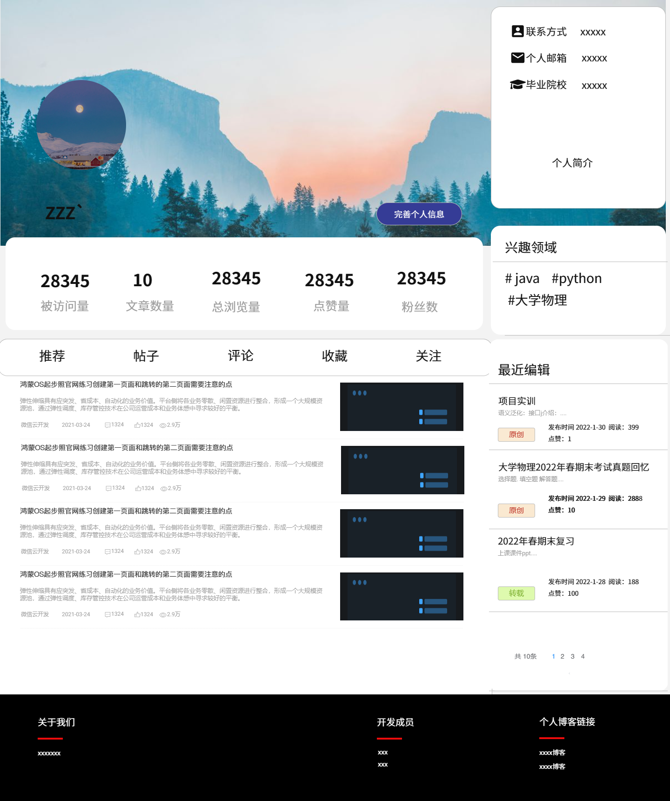
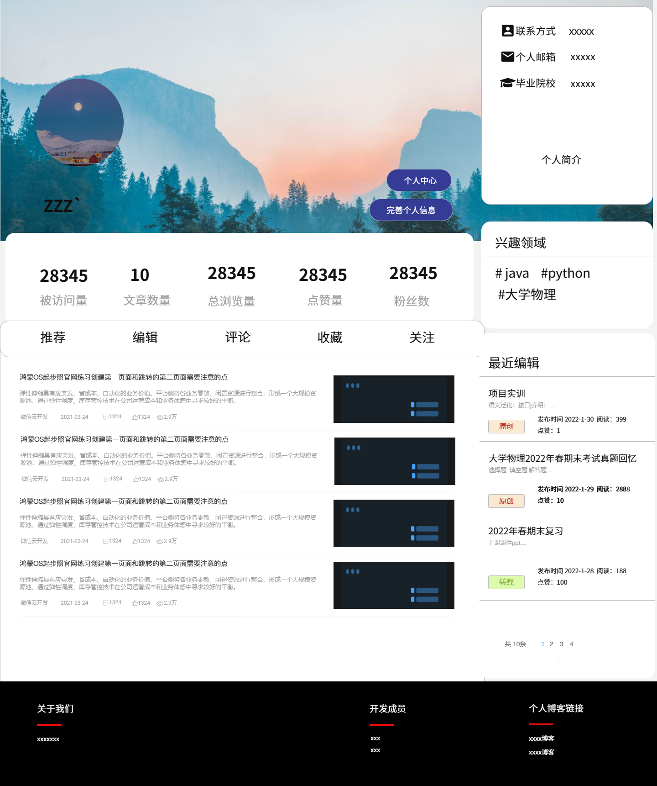
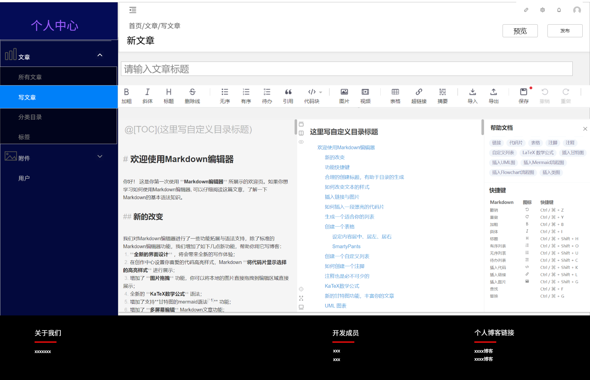

# 个人博客案例设计

## 一. 引言

### 1. 项目背景

个人博客系统主要用于发表个人博客，记录个人生活日常、学习心得以及技术分享等，供他人浏览、查阅、评论等。个人博客往往作为技术人员的个人知识发布管理平台，以便于记录某项技术使用教程，也有利于与同行业的从业人员进行交流。

本项目致力于构建一个个人博客平台, 每个注册用户都可以发布,管理自己的博客, 也可以浏览,评论他人的博客. 系统还包含了搜索功能和关注功能, 用户可以方便地寻找到自己需要的功能, 并及时得到来自关注博主的消息. 此外, 由于博文采用富文本形式展现, 平台还包含了文件存储的功能, 用户可以将上传的图片嵌入到自己的博客中, 或上传资源分享给别人. 

### 2. 用户特征和水平

本软件主要面向计算机技术人员, 计算机专业的学生,从业者,爱好者. 编写博客的人应该有基础的markdown标记语言的使用技能, 愿意分享技术.

## 二. 需求描述

### 1. 功能需求 (概要)

个人博客涉及到的角色不多. 这里按照博主和浏览者两个角色列出功能. 

1. 博主功能

| 功能         | 描述                                                         |
| ------------ | ------------------------------------------------------------ |
| 登录注册     | 非注册用户只可以浏览和搜索.                                  |
| 博客编写发布 | 这主要是前端的功能, 要提供一个markdown编辑器, 以及发布的选项(是否允许评论等). 参见本节末示例开源项目*Sonic*. |
| 博客管理     | 列出当前用户的所有博文, 点击进入博文详情页后可以编辑管理博文的权限, 如设置是否允许评论,审核评论,设置公开/私有等等. |
| 标签系统     | 用户可以自己添加标签. 系统会定时招安定义次数多的标签         |
| 附件管理     | 上传,删除附件/图片/其他多媒体, 可以复制链接以便在富文本编辑器中使用. |

> 上述大部分功能来源于项目*Sonic*. 请在本节末的示例开源项目中查询.

2. 浏览者功能

| 功能         | 描述                                                         |
| ------------ | ------------------------------------------------------------ |
| 主页         | 主页会按照时间/热度顺序列出所有的博文, 以及点赞数量等信息; 提供个人中心和搜索的入口 |
| 搜索         | 提供基于标签搜索和基于文本搜索的功能.                        |
| 评论回复     | 浏览者可以评论帖子, 或回复他人的评论. 这些操作将通知被评论/回复者. |
| 点赞收藏关注 | 可以点赞帖子或评论. 也可以收藏他人帖子或关注博主. 这些操作都会有相应的通知 |
| 个人中心     | 设置注册信息(账号密码), 收藏信息(帖子), 关注者信息, 以及通知管理等功能. |

3. 其他功能

| 功能                     | 描述                                                         |
| ------------------------ | ------------------------------------------------------------ |
| 热点标签挖掘             | 博客系统允许用户自己定义标签; 这个功能可以挖掘出博主共识的标签, 以便在博主发布博文的时候给予推荐. |
| 热门博客推荐             | 基于点赞数和评论数量, 在首页展示博文的时候对博文排序.        |
| 基于语义相似度的博客搜索 | 以ElasticSearch为基础, 但基于协同过滤等方法提供更好的博客搜索体验. |

详情请看用例图. 

### 2. 性能需求

1. 系统必须有能力支持1000个以上的并发用户
2. 系统必须有能力支持5000个以上的用户注册
3. 系统不限制发布博文的字符数量
4. 系统中博客管理信息的生效时间应该应该小于1秒，最大生效时间应该小于5秒
5. 对于每个用户的访问，平均响应速度应该小于1秒，最大响应时间应该小于5秒
6. 在用户搜索文章时，系统返回搜索结果的时间应该小于1秒，最大时间应该小于5秒

为做到这一点, 我们会应用到如下技术: 

1. 微服务架构. 微服务的架构可以方便地横向扩展瓶颈功能; 
2. Redis缓存: 对于热点功能, 我们可以考虑使用redis作为缓存, 降低过多的数据库IO操作;
3. JMeter: 性能测试工具, 可用于找出性能瓶颈所在. 

### 3. 外部接口

外部接口分为系统接口, 用户接口(UI), 硬件接口, 软件接口, 通信接口等. 由于个人博客平台是一个相对独立的软件, 不需要与其他硬件软件系统交互, 对网络通讯也没有额外的要求, 所以此部分将主要精力放在用户接口上. 对于个人博客平台即界面. 

主页: 

个人中心: 

后台编辑中心：

### 4. 设计约束

1. 系统设计过程中必须使用Java语言编写系统内容，主页推荐算法模块可以采用Python实现，非必要不使用其他语言以免造成不同微服务之间在Nacos的注册问题。
2. 系统设计时需考虑在单机器部署时能够响应1000次/秒的首页响应请求，在多机器部署的时候能响应至少5000次/秒的首页响应请求。并且任取10秒，一个特定应用所消耗的可用计算能力平均不超过50%。
3. 系统设计时需前后端分离且所采用技术需为业界前沿技术，架构需采用微服务架构便于后续迭代和维护，不得因为方便而使用业界过期或是存在缺陷的技术进行前后端设计。
4. 系统在部署时应部署在Linux环境，因而设计时必须考虑实际生产环境和开发环境不同所带来的问题并进行处理。
5. 系统设计时前后端通信应该采用https加密形式进行，对于敏感信息应当在设计时考虑安全性问题。
6. 系统在设计时需考虑用户使用问题，应当以简洁明了为主。降低用户的使用和学习成本，且重要功能主题鲜明，界面美观。
7. 系统在设计时应该考虑容灾问题，具备出现一定故障时能够自动报警或不影响其他模块正常运行，不影响数据库和缓存的准确性。

### 5. 质量属性

| 属性名称       | 详细要求                                                     |
| -------------- | ------------------------------------------------------------ |
| 性能及效率     | 当系统在单个机器上部署时, 使集群至少能够响应1000次/秒的首页请求响应; 在多个节点上部署时, 能够响应5000次/秒的首页请求响应; 所有界面应该在5秒之内完成界面框架的加载, 7秒内填充来自后端的数据 对于搜索功能, 响应时间不应超过5秒. |
| 易用性, 清晰性 | 系统界面设计应与主流博客平台相似, 降低用户迁移的学习成本; 从页面设计上, 界面的主次设计鲜明, 主要部分展示数据, 次要部分包含全面的跳转链接. 用户上手时间不应超过5分钟, 在15分钟内了解绝大多数功能. |
| 安全性         | 前后端采用https加密; 对于用户敏感信息(如密码等)采用加密算法. |
| 可扩展性       | 后端API将搜索,热搜,排序等功能抽象, 可以在工期足够时采用不同的算法实现功能. |
| 可移植性       | 系统采用docker部署, 因此可以在任意x86-64架构的linux系统(包括WSL)节点上部署. |
| 健壮性         | 微服务节点由nacos管理, 节点失败重启时间不应超过10秒;  失败不应影响到持久化存储的数据, 尽量避免影响到缓存数据(如redis). |

> 示例开源项目:  
>
> | 名称     | 链接                                      |
> | -------- | ----------------------------------------- |
> | 蘑菇博客 | https://gitee.com/moxi159753/mogu_blog_v2 |
> | MCMS     | https://gitee.com/mingSoft/MCMS           |
> | OneBlog  | https://gitee.com/yadong.zhang/DBlog      |
> | SONIC    | https://github.com/go-sonic/sonic         |

## 三. 开发框架和技术

项目采用前后端分离的方案, 采用目前流行的技术框架. 

| 部分         | 技术                             | 描述                                          |
| ------------ | -------------------------------- | --------------------------------------------- |
| 前端         | Vue                              | 当前前端最流行的三大框架之一                  |
| 后端框架     | SpringMVC + SpringBoot + MyBatis | 目前Java系最主流的轻量级后端框架              |
| 后端架构     | SpringCloud + Nacos              | 微服务架构, 方便横向扩展                      |
| 测试         | JUnit + JMeter                   | 分别是最主流的单元测试和黑盒测试工具          |
| 部署         | docker                           | -                                             |
| 缓存         | redis                            | 内存缓存器                                    |
| 搜索组件     | ElasticSearch                    | 用于博客搜索功能                              |
| 反向代理     | Nginx                            | 方便负载均衡                                  |
| 消息队列     | rabbitMQ / RocketMQ              | 用于消息推送功能                              |
| 搜索算法     | 协同过滤 / 基于语义相似度的匹配  | 搜索功能的具体实现                            |
| 搜索性能优化 | 召回,粗排和精排                  | 提前给帖子做排序/索引, 以便增加搜索的速度     |
| 热点标签挖掘 | 聚类                             | 从用户自定义的标签中挖掘出共识/流行的标签     |
| 热点博客推荐 | 常规推荐算法                     | 基于用户点赞数和评论数量推荐全平台的热点博文. |

## 四. 项目计划

### 1. 成员和分工

> 待定...

### 2. 项目开发过程简介

考虑到功能的复杂性, 我们将功能分为核心功能,主要功能和次要功能. 

> 功能的划分见用例图.

| 阶段     | 时间段    | 内容                                              |
| -------- | --------- | ------------------------------------------------- |
| 第一阶段 | 1.28~2.6  | 完成界面框架的设计, 完成核心功能的设计,编码和测试 |
| 第二阶段 | 2.6~2.12  | 完成主要功能的设计,编码和测试                     |
| 第三阶段 | 2.13~2.17 | 完成次要功能的设计,编码和测试                     |

### 3. 开发工具

| 功能          | 工具              |
| ------------- | ----------------- |
| IDE           | vscode, IDEA      |
| 版本/项目管理 | git, github/gitee |
| 软件设计绘图  | drawio, ProcessOn |
| 界面设计      | 墨刀              |

